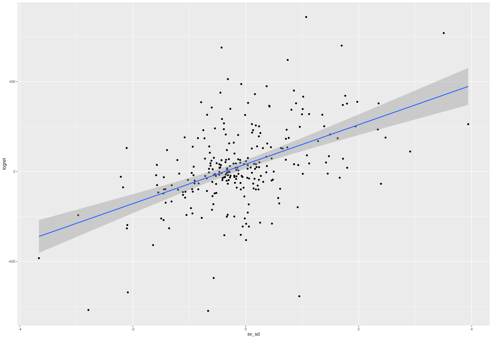

# Eth price impact estimates

This project estimate the price impact of Eth trading on Eth returns using aggrergated signed exchange data. 

## Data
Data is extracted from exchange APIs (Binance, Bitfinex, Bitstamp, Bybit, Coinbase, Gateio, Kraken, MEXC, OKX, and Upbit). Data sample is from July 2023 to March 2024.

## Methodology

The methodology is based on estimating Kyle's lambda by regressing returns on signed net volume.

## Key results

(1) full sample; (2) daily signed volume > 0 subsamples (3) daily signed volume < 0 subsamples

|                        | (1)         | (2)         | (3)          |
|------------------------|-------------|-------------|--------------|
| **Dependent variable** | **logret**  | **logret**  | **logret**   |
| sv_sd                  | 87.819***   | 92.102***   | 106.609***   |
|                        | (10.029)    | (21.904)    | (19.848)     |
| Constant               | 32.611***   | 20.423      | 51.746***    |
|                        | (10.081)    | (24.227)    | (18.471)     |
| **Observations**       | 260         | 105         | 155          |
| **R2**                 | 0.229       | 0.147       | 0.159        |
| **Adjusted R2**        | 0.226       | 0.138       | 0.153        |
| **Residual Std. Error**| 161.716 (df = 258) | 175.981 (df = 103) | 151.718 (df = 153) |

*Note: *p<0.1; **p<0.05; ***p<0.01*

